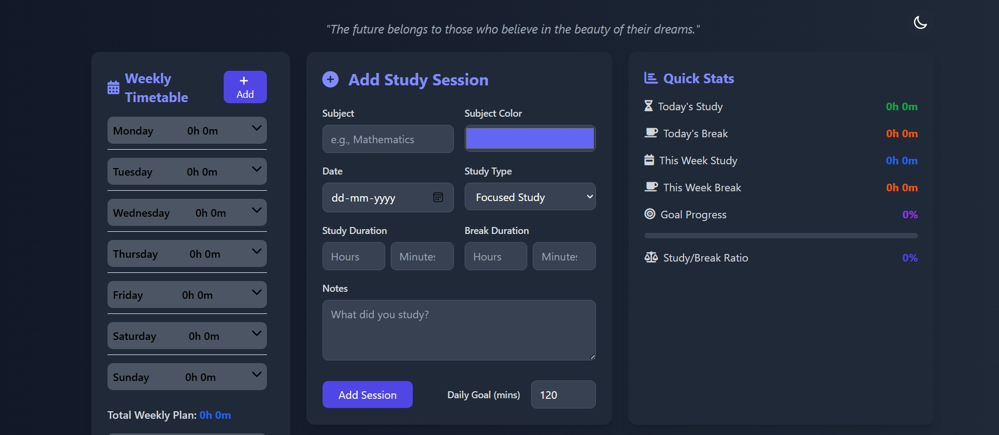
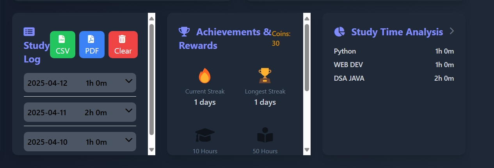
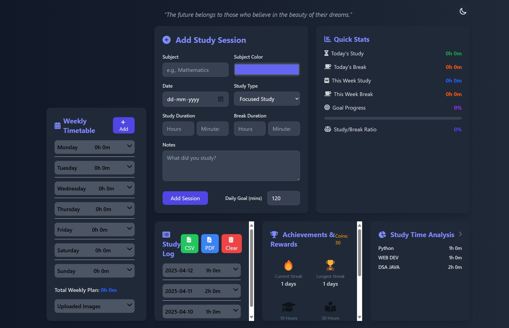

# 📚 Study Tracker Pro

A powerful web application built with HTML, CSS, and JavaScript to help students and lifelong learners track study sessions, manage weekly schedules, visualize progress, and stay motivated. All data is stored locally in your browser for privacy.

## ✨ Features

### Core Functionality
- 📝 **Log Study Sessions:** Record details including Subject, Date, Study Type (Focused, Review, Practice, Group), Study Duration, Break Duration, and Notes
- 🎨 **Subject Management:** Assign custom colors to different subjects for easy visual tracking
- 📅 **Weekly Timetable:** Create and manage a planned weekly schedule with subjects, durations, and days
- 📸 **Timetable Image Uploads:** Upload images of physical timetables for quick reference

### Analytics & Visualization
- 📊 **Quick Stats Dashboard:** See summaries of today's and this week's study/break time, goal progress, and study-to-break ratio
- 📈 **Study Analysis:** Get deeper insights into your study habits with breakdowns by subject and detailed break logs
- 📜 **Detailed Study Log:** View your complete history of study sessions, neatly organized and collapsible by date

### Motivation & Productivity
- 🎯 **Daily Goal Setting:** Set target study times and track progress with a visual progress bar
- 🔥 **Study Streaks:** Track consecutive study days to build consistent habits
- 🏆 **Achievements:** Unlock badges for reaching various study milestones
- 💰 **Reward System:** Earn virtual coins for consistent study sessions

### User Experience
- 🌓 **Dark Mode:** Toggle between light and dark themes for comfortable viewing
- 💬 **Motivational Quotes:** Daily inspiration to keep you motivated
- 💾 **Data Export:** Export your study data to CSV or generate weekly summary reports in PDF format
- 🔒 **Local Storage:** All user data is saved securely in your browser's local storage

## 🚀 Getting Started

1. Clone this repository
   ```
   git clone https://github.com/yourusername/study-tracker-pro.git
   ```
2. Open `index.html` in your browser
3. Start tracking your study sessions!

## 🔧 Technologies Used

- HTML5
- CSS3
- JavaScript (Vanilla)
- Local Storage API
- Chart.js (for visualizations)

## 📷 Screenshots





## 🤝 Contributing

Contributions are welcome! Please feel free to submit a Pull Request.

## 🙏 Acknowledgements

- Icons provided by [FontAwesome](https://fontawesome.com/)
- Motivational quotes API by [Type.fit](https://type.fit/api/quotes)
- Color palette inspiration from [Coolors](https://coolors.co/)

---

Made with ❤️ by Vansh Tyagi
